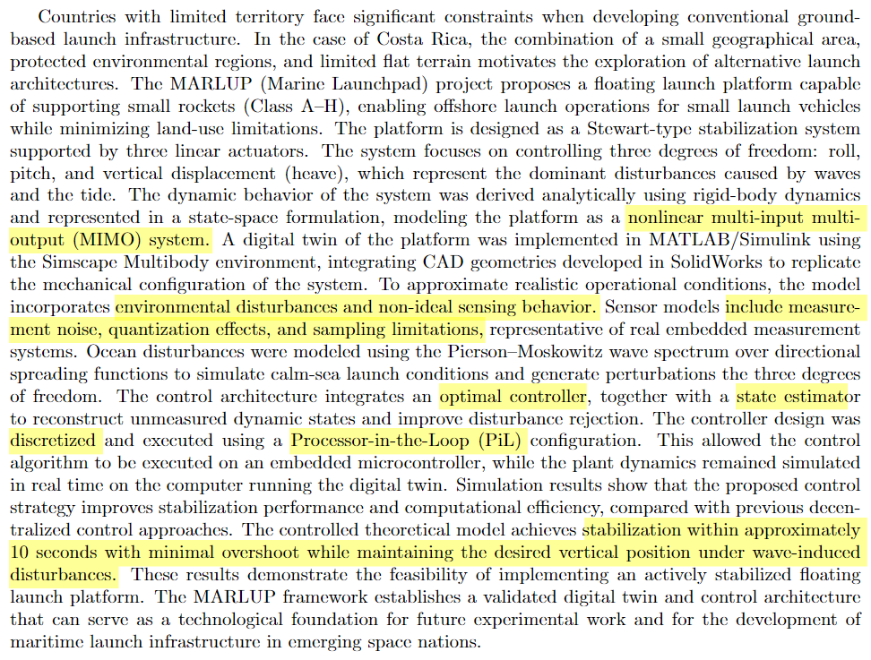

# Guía para correr archivos de MATLAB

En este folder hay siete archivos. Cuatro de ellos se usan para correr el sistema sin Filtro de Kalman con LQR, otros dos corren el sistema con Filtro de Kalman. El último archivo no está finalizado pero se puede usar en conjunto con otros para mejorar el sistema con Filtro de Kalman.

## Sistema sin Filtro de Kalman

Este sistema tiene mejor performance que el que tiene KF: corre más rápido, no tiene error y es más fácil de editar. El problema es que en el abstract del paper que mandamos a IAC dijimos que usabamos KF.

Para correr este sistema primero se deben abrir los archivos y correrlos en el orden: 

`marlup_identify.m` ➡️ `marlup_design.m` ➡️ `marlup_apply_lqr.m`

Una vez aplicados los cambios al modelo por el último programa, se puede correr el sistema `MARLUP_sinKF.slx`. Es importante no cambiarle el nombre al archivo .slx, o si se cambia, revisar todas las instancias en las que se cambia en los archivos anteriores y cambiarlo ahí también. 

Puede que la variable Hs del espectro PM para el olejae se haya reseteado a 0. En caso que no se vean olas, se debe de setear manualmente a un valor mayor a 0 (default: 0.5).

## Sistema sin Filtro de Kalman

Este sistema es mucho más lento que el anterior, pero utiliza el filtro de Kalman para estimar todas las variables de estado x. Se debe correr el archivo `MARLUP_FINAL.m` para guardar las variables en el espacio de trabajo antes de correr `MARLUP_conKF.slx`. 

Este segundo sistema tiene problemas con el bloque KF, por lo que todavía hay que revisarlo. También, el rechazo de error en este sistema no es tan bueno como en el anterior. Cabe revisar ambos sistemas para ver si al anterior se le puede agregar KF de una manera más sencilla, o si este se puede mejorar. 

## Trabajo restante

Según lo que se escibió en el resumen del paper a presentar en el IAC, se deben de cumplir las siguientes promesas:

- Que el sistema a controlar sea no-lineal, MIMO.
- Que el sistema presente disturbios en el ambiente producidos por un oleaje artificial (Espectro PM).
- Que el sistema presente sensado no-ideal, específicamente, ruido de medición, efectos de cuantización y limitaciones de muestreo. 
- Que el controlador sea de tipo óptimo.
- Que el sistema cuente con un estimador de estados (no específicamente un Filtro de Kalman, podemos diseñar uno más sencillo) para reconstruir los estados que no se pueden medir de la planta y mejorar el rechazo de disturbios en las mediciones no ideales.
- Que el sistema sea discreto para usar un PiL.
- Que el sistema se estabilice en menos de 10 segundos, con mínimo sobreimpulso, y que se quede vertical. 

