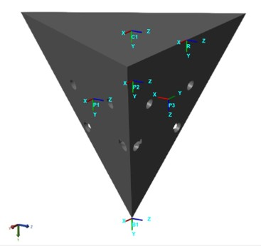
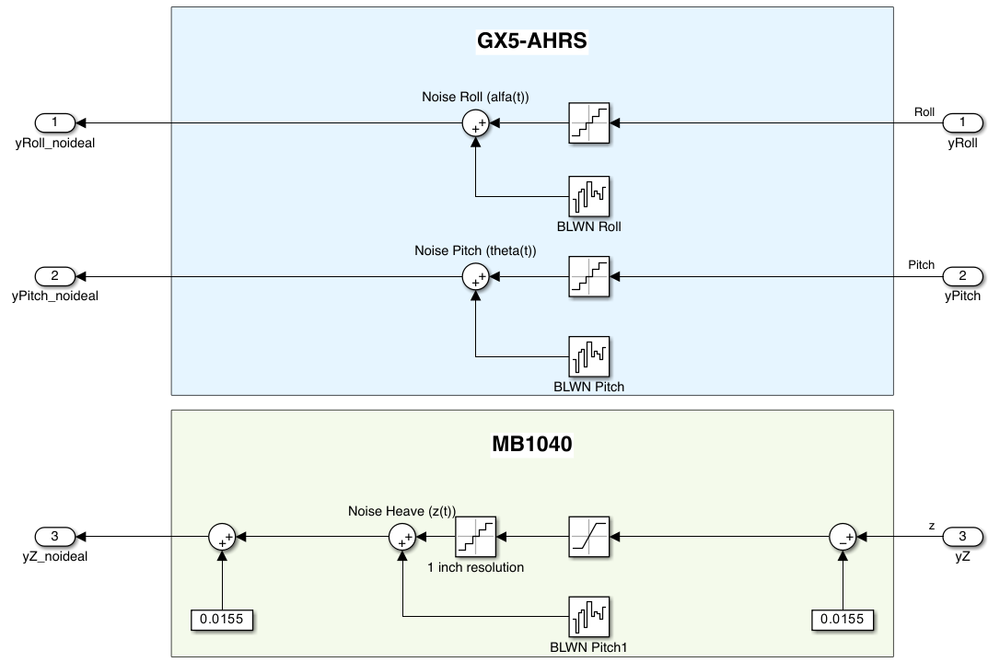
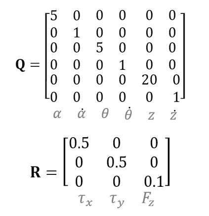
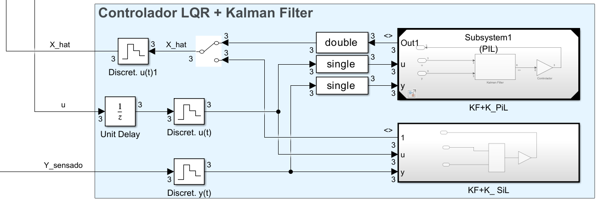
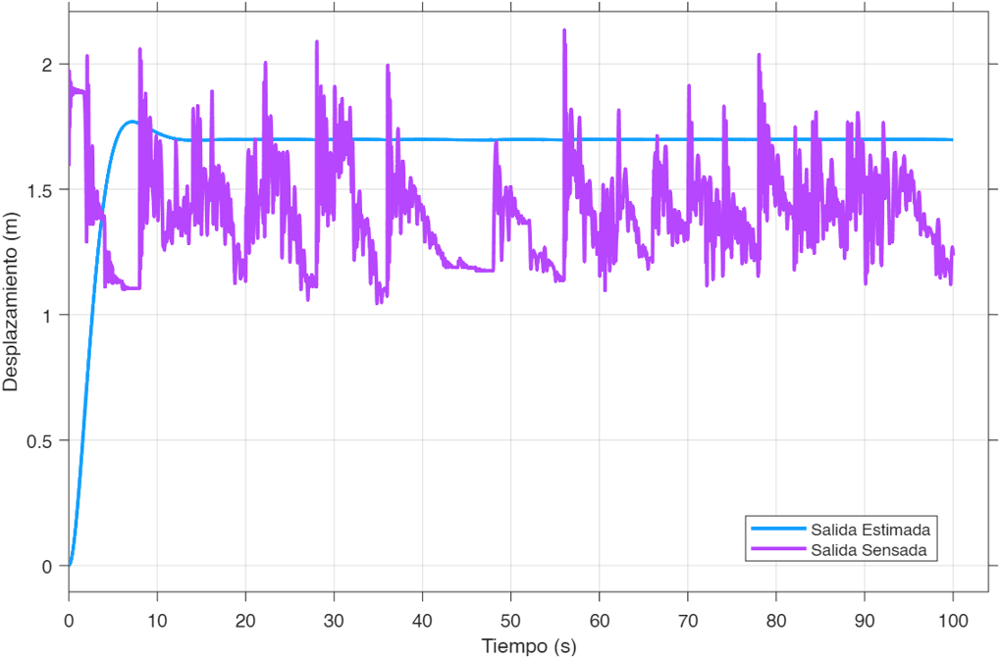
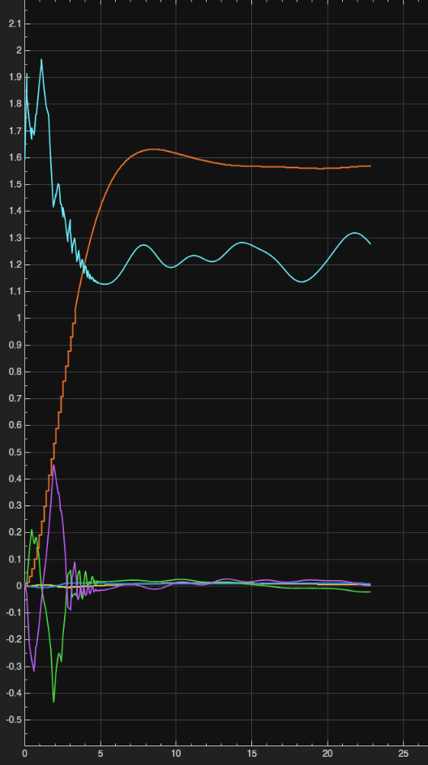

# MARLUP


Plataforma marina autoestabilizada para el lanzamiento de cohetes: 3 actuadores compensan roll, pitch y heave ante el oleaje. Desarrollado por **TECSpace**, la organización estudiantil de ingeniería aeroespacial del Instituto Tecnológico de Costa Rica (TEC).

## Índice

- [Contexto y evolución del proyecto](#contexto-y-evolución-del-proyecto)
- [Arquitectura física](#arquitectura-física)
  - [Geometría de la pirámide invertida](#geometría-de-la-pirámide-invertida)
  - [Modelo en espacio de estados](#modelo-en-espacio-de-estados)
  - [Actuadores](#actuadores)
  - [Sensores](#sensores)
  - [Perturbación por oleaje](#perturbación-por-oleaje)
- [Estrategia de control](#estrategia-de-control)
  - [LQR y matrices de ponderación](#lqr-y-matrices-de-ponderación)
  - [Filtro de Kalman discreto](#filtro-de-kalman-discreto)
  - [Extensión LQI (integrador de error)](#extensión-lqi-integrador-de-error)
  - [Precompensación / estado estacionario](#precompensación--estado-estacionario)
  - [Verificación PIL / SIL](#verificación-pil--sil)
- [Resultados de simulación](#resultados-de-simulación)
- [Estructura del repositorio](#estructura-del-repositorio)
- [Cómo ejecutar el modelo](#cómo-ejecutar-el-modelo)
- [Informes técnicos](#informes-técnicos)
- [Equipo](#equipo)

## Contexto y evolución del proyecto

El proyecto se ha desarrollado en dos etapas dentro del curso de Control:

| Etapa | Autoras/es | Alcance |
|---|---|---|
| **1 — Modelado inicial** | Hillary González González, Kendall Guerrero González | Modelado de la plataforma en *Simscape Multibody* (planta con pistones ideales, sensor ideal sin ruido) y control **PID individual por eje**. Solo simulación, sin prototipo físico. |
| **2 — Control óptimo** | Álvaro Pérez Mora, William Smith Hernández | Aproximación teórica simplificada de la planta, controlada con **LQR + estimador de Kalman**, y verificación del mismo controlador contra la planta simulada. Implementación en *Processor in the Loop* (PIL) sobre un Arduino MEGA. |

El repositorio actual (`MODELS/`) continúa esta línea de trabajo y **extiende el controlador LQR de la Etapa 2 con un integrador de error (LQI)**, para eliminar el error de estado estacionario sin depender únicamente de la precompensación *feedforward*.

La plataforma se modela como un sistema **MIMO no lineal** con tres actuadores lineales independientes cuya acción conjunta mantiene el plato superior nivelado.

## Arquitectura física

El sistema consiste en un plato circular superior (masa `M`, momentos de inercia `Jx`, `Jy`) sostenido por tres actuadores lineales dispuestos sobre una **pirámide triangular invertida**, anclada a la estructura de flotación de MARLUP.

### Geometría de la pirámide invertida



*Esquema de la pirámide triangular invertida: los actuadores se ubican en las caras P1, P2, P3, con marco de referencia global R y marco del plato C1.*

**Dimensiones de la pirámide:**

- Altura: $H = 0.11\text{ m}$
- Radio circunscrito de la base: $R_b = 0.13\text{ m}$
- Radio de los puntos de aplicación en el plato: $R_t = 0.65\text{ m}$
- Ángulos de los actuadores sobre el plato: $\phi = \{-30°,\ 90°,\ 210°\}$

Los actuadores empujan perpendicularmente a cada cara de la pirámide. La componente vertical del vector unitario de empuje es común a los tres actuadores:

$$u_z = \frac{R_b}{\sqrt{R_b^2 + 4H^2}} \approx 0.5087$$

Cada punto de aplicación sobre el plato, respecto a su centroide, es:

$$\Delta \mathbf{r}_i = \begin{bmatrix} R_t \cos\phi_i \\ R_t \sin\phi_i \\ 0 \end{bmatrix}$$

Los esfuerzos generalizados del sistema $(\tau_x, \tau_y, F_z)$ se obtienen de las fuerzas de los tres actuadores $(F_1, F_2, F_3)$ mediante la **matriz de transformación** $T$:

$$\begin{bmatrix} \tau_x \\ \tau_y \\ F_z \end{bmatrix} = T \begin{bmatrix} F_1 \\ F_2 \\ F_3 \end{bmatrix}, \qquad T_i = \begin{bmatrix} R_t \sin\phi_i\, u_z \\ -R_t \cos\phi_i\, u_z \\ u_z \end{bmatrix}$$

Para $\phi = \{-30°, 90°, 210°\}$:

$$T = u_z \begin{bmatrix} -0.5 R_t & R_t & -0.5 R_t \\ -0.866 R_t & 0 & 0.866 R_t \\ 1 & 1 & 1 \end{bmatrix}$$

Para el reparto de fuerzas deseadas entre los tres actuadores se usa la pseudoinversa de $T$:

$$F = T^{+}\, u_{\text{des}}, \qquad T^{+} = \operatorname{pinv}(T)$$

### Modelo en espacio de estados

Considerando únicamente roll, pitch y heave, sin amortiguamiento ni rigidez, la dinámica del plato es un sistema lineal de segundo orden desacoplado:

$$J_x\ddot{\alpha} = \tau_x, \qquad J_y\ddot{\theta} = \tau_y, \qquad M\ddot{z} = F_z$$

En espacio de estados, $\dot{x} = Ax + Bu,\ \ y = Cx + Du$, con:

$$x = \begin{bmatrix}\alpha & \dot\alpha & \theta & \dot\theta & z & \dot z\end{bmatrix}^\top,\qquad u = \begin{bmatrix}\tau_x & \tau_y & F_z\end{bmatrix}^\top,\qquad y = \begin{bmatrix}\alpha & \theta & z\end{bmatrix}^\top$$

$$A = \begin{bmatrix} 0&1&0&0&0&0\\0&0&0&0&0&0\\0&0&0&1&0&0\\0&0&0&0&0&0\\0&0&0&0&0&1\\0&0&0&0&0&0 \end{bmatrix},\quad B = \begin{bmatrix} 0&0&0\\1/J_x&0&0\\0&0&0\\0&1/J_y&0\\0&0&0\\0&0&1/M \end{bmatrix},\quad C = \begin{bmatrix} 1&0&0&0&0&0\\0&0&1&0&0&0\\0&0&0&0&1&0 \end{bmatrix}$$

El sistema es controlable ($\operatorname{rank}(\operatorname{ctrb}(A,B)) = 6$) y se discretiza con retenedor de orden cero (ZOH) a un período de muestreo global $T_s = 0.01\text{ s}$, obteniendo $(A_d, B_d, C_d, D_d)$.

### Actuadores

Los actuadores planteados para la planta son cilindros **hidráulicos lineales Rexroth CDH1 MP3** (Bosch), seleccionados por su confiabilidad, estabilidad y capacidad de respuestas rápidas con fuerza significativa.

| Parámetro | Valor |
|---|---|
| Recorrido máximo del pistón | 1 m |
| Longitud total del actuador | 2 m |
| Presión del sistema | 250 bar |
| Área del pistón | 12.5 cm² |
| Área del anillo | 6.4 cm² |
| Carga aplicada | 58.19 kg |
| Alimentación eléctrica | 24 V DC a 200 mA |
| Desviación lineal | ≤ 500 mm |
| Resolución | 100 μm |

En el modelo teórico actual del repositorio, los actuadores se representan como ganancias ideales (torques/fuerza aplicados directamente a la planta); la dinámica realista del pistón (fricción, saturación, ancho de banda) se modeló por separado en Simscape durante la Etapa 2, pero no forma parte del modelo idealizado activo en `MODELS/`.

### Sensores

El sensado no ideal se modela con dos dispositivos:

- **3DM-GX5 AHRS** — entrega roll y pitch, con ruido blanco de banda limitada (BLWN) sumado a la señal.
- **MB1040** (ultrasónico) — entrega heave, con cuantización de 1 pulgada de resolución más ruido BLWN.



*Modelo Simulink de los sensores no ideales: AHRS para roll/pitch y sensor ultrasónico para heave.*

### Perturbación por oleaje

El oleaje se modela como un disturbio de **salida**, no de estado:

$$y_{\text{total}} = Cx + P_{\text{reorder}}\, y_{\text{amb}}$$

El subsistema de oleaje entrega sus salidas en el orden `[heave; pitch; roll]`, mientras el modelo espera `[roll; pitch; heave]`; `P_reorder` corrige ese orden antes de sumar la perturbación.

La energía del oleaje se distribuye según el espectro de **Pierson-Moskowitz**, adecuado para mar completamente desarrollado (sin dependencia del viento):

$$S_\eta(\omega) = \frac{5}{16}\,\frac{H_s^2\,\omega_p^4}{\omega^5}\exp\!\left[-\frac{5}{4}\left(\frac{\omega_p}{\omega}\right)^{4}\right]$$

donde $\omega_p$ es la frecuencia pico del espectro y $H_s$ la altura significativa de ola. Este espectro se combina con una función de dispersión direccional (coseno cuadrado) para generar el oleaje 3D que perturba el eje $z$ y, mediante sus derivadas parciales en $x$ y $y$, los ángulos de roll y pitch.

## Estrategia de control

### LQR y matrices de ponderación

El controlador base es un **regulador lineal cuadrático (LQR)**: penaliza fuertemente el error de heave, medianamente el error angular, y levemente las velocidades y el esfuerzo de control.



*Matrices $Q$ y $R$ del diseño LQR documentado en el informe de la Etapa 2. La implementación actual en `MODELS/marlup_init.m` reutiliza esta misma estructura de penalización, pero con ganancias reajustadas para el diseño LQI (ver más abajo).*

### Filtro de Kalman discreto

Dado que solo se sensan roll, pitch y heave (no sus velocidades), se requiere un estimador para reconstruir el vector de estado completo. Se emplea un **filtro de Kalman discreto** obtenido con `dlqe`:

$$\hat{x}(k+1\mid k) = A_d\,\hat{x}(k\mid k) + B_d\,u(k)$$

$$\hat{x}(k+1\mid k+1) = \hat{x}(k+1\mid k) + L_d\,\big(y(k+1) - C_d\,\hat{x}(k+1\mid k)\big)$$

La covarianza de proceso $Q_x$ pondera más las velocidades (mayor incertidumbre), y la de medición $R_n$ refleja el ruido real de los sensores: 0.5° en roll/pitch, 3 mm en heave.

### Extensión LQI (integrador de error)

Para eliminar el error de estado estacionario ante perturbaciones sostenidas de oleaje, el repositorio **aumenta la planta discreta con un integrador de error** por salida y diseña una ganancia LQI:

$$A_{\text{aug}} = \begin{bmatrix} A_d & 0 \\ -C_d A_d & I \end{bmatrix},\qquad B_{\text{aug}} = \begin{bmatrix} B_d \\ -C_d B_d \end{bmatrix}$$

$$K_{\text{aug}} = \operatorname{dlqr}(A_{\text{aug}}, B_{\text{aug}}, Q_{\text{aug}}, R) = \begin{bmatrix} K_x & K_i \end{bmatrix}$$

$$u(k) = -K_x\,\hat{x}(k) - K_i\, z_I(k), \qquad z_I(k) = \sum e(k),\ \ e = r - y_{\text{total}}$$

El diseño se valida además con la función `lqi` de MATLAB sobre el sistema discretizado como verificación cruzada. El diseño LQR continuo (`K`), su observador (`L`) y la ganancia de precompensación (`Kr`) se conservan como variante **sin integrador**; `Kr` no debe combinarse con el control LQI.

### Precompensación / estado estacionario

Para la variante sin integrador, el valor de estado estacionario se fija con una matriz *feedforward* $K_r$, resuelta de forma que $y_{ss} = r$:

$$y_{ss} = C\big(-(A-BK)^{-1}B\,K_r\big)r = r \quad\Longrightarrow\quad K_r = \operatorname{pinv}\!\big(C(-(A-BK)^{-1})B\big)$$

### Verificación PIL / SIL

El controlador LQR y el filtro de Kalman se validaron ejecutándolos en un **Arduino MEGA** mediante *Processor in the Loop* (PIL), en comunicación constante con la PC que simula el resto de la planta. Un interruptor en Simulink permite alternar entre PIL y *Software in the Loop* (SIL) para comparar ambas respuestas contra la misma simulación.



*Bloque de control en Simulink con las rutas PIL (ejecución en Arduino MEGA) y SIL (ejecución en PC), comparadas en paralelo.*

## Resultados de simulación



*Heave: salida sensada (con ruido) contra la salida estimada por el filtro de Kalman, que filtra el ruido de medición y converge a la referencia.*



*Transitorio de estimación: las variables estimadas convergen desde la condición inicial hacia sus valores sensados, con el error de estimación decreciendo en el tiempo.*

Videos adicionales de las simulaciones (respuesta del modelo teórico, comparación con y sin Kalman, corridas fallidas de depuración) están disponibles en [`DOCS/FIGS/`](DOCS/FIGS/).

## Estructura del repositorio

```
MARLUP/
├── CAD/          Piezas SolidWorks (.SLDPRT) y ensamble principal (.SLDASM)
│                 usados por los bloques File Solid del modelo Simulink.
├── DOCS/         Informes finales (PDF) y DOCS/FIGS/ con figuras y videos de resultados.
├── MODELS/       Script MATLAB (marlup_init.m) + modelo Simulink (marlup_model.slx) activos.
└── EXPERIMENTS/  Copias de trabajo por integrante (Aaron/, Alvaro/, Will/) para
                  probar ajustes de ganancias de forma independiente.
```

## Cómo ejecutar el modelo

1. Abrir MATLAB en la raíz del repositorio y ejecutar `MODELS/marlup_init.m`. Esto define la planta, discretiza el sistema, calcula el filtro de Kalman y las ganancias de control, y las deja en el *workspace* (`Ad`, `Bd`, `Cd`, `Kx`, `Ki`, `Ld`, `T`, `Tinv`, `P_reorder`, etc.). También agrega `CAD/` al *path* para que el modelo encuentre la geometría por nombre.
2. Abrir `MODELS/marlup_model.slx` y correr la simulación — el modelo lee las variables anteriores del *workspace* base, por lo que falla si el script no se ejecutó antes en la misma sesión.
3. Todos los bloques discretos del modelo deben usar el mismo período de muestreo `Ts` definido en el script (`0.01 s`).

No hay sistema de *build*, gestor de paquetes ni suite de pruebas: todo el flujo vive dentro de MATLAB/Simulink.

## Informes técnicos

- [`DOCS/Final_Alvaro_Perez_William_Smith.pdf`](DOCS/Final_Alvaro_Perez_William_Smith.pdf) — *Avance Final MARLUP, Control Stage 2*: modelado teórico de la planta, diseño LQR + Kalman, actuadores, sensores, oleaje y verificación PIL/SIL.
- [`DOCS/InformeFinal_Proyecto_Lab_Control.pdf`](DOCS/InformeFinal_Proyecto_Lab_Control.pdf) — *Sistema de Control Activo para la Estabilización de la Plataforma MARLUP*: modelado inicial en Simscape Multibody y control PID individual por eje.

## Equipo

**TECSpace**, organización estudiantil de ingeniería aeroespacial del Instituto Tecnológico de Costa Rica (ITCR).

- Hillary González González, Kendall Guerrero González — Etapa 1 (modelado y PID).
- Álvaro Pérez Mora, William Smith Hernández — Etapa 2 (LQR + Kalman, PIL/SIL).
- Aaron, Álvaro, Will — ajuste de ganancias y experimentación continua (`EXPERIMENTS/`).
